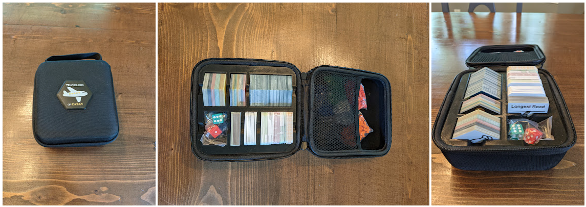
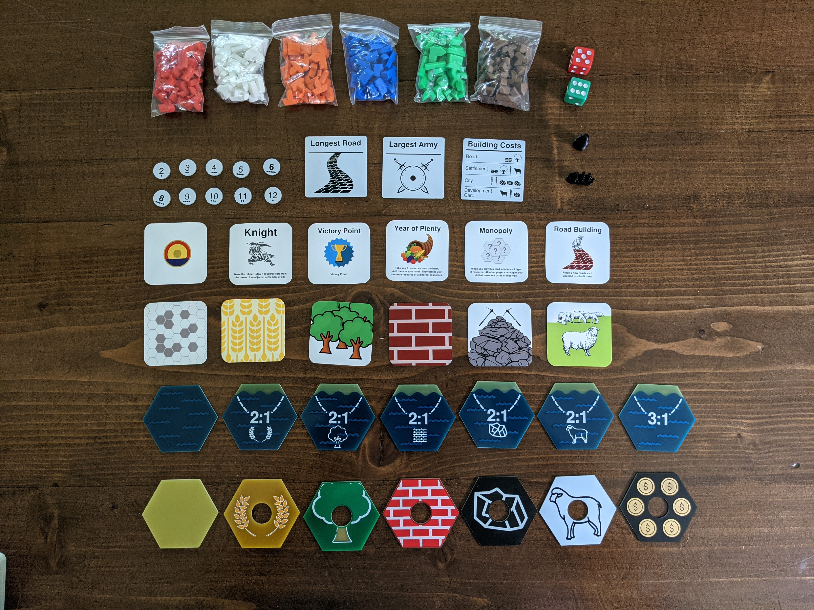

# Travelers of Catan
Travel-ready Version of Settlers of Catan using PCBs as the tiles.

This project uses the fact that you cvan easily order Custom PCBs in different colors to create a custom Settlers of Catan set miniturized, rugged, and ready for travel.  It also incorpoarates custom "business cards" as the playing cards for the set and 3D printed pieces.  

The set includes all the tiles, pieces, and cards needed for the regular set, the expansion kit (denoted on tiles and number pieces with "EX" on the back), and seafarers.

I used KICAD to design the PCBs, JLCPCB to order the PCBs, and 48HourPrint for the business cards.  Beyond that, the pieces just need to be printed in the appropriate colors.

## Bill of Materials (BOM) for one full-kit:

_format for all below quantities is: base + expansion = total_

### Tiles (PCB)
- [Brick](Tiles/brick/): 3+2 = 5
- [Ore](Tiles/ore/): 3+2 = 5
- [Sheep](Tiles/sheep/): 4+2 = 6
- [Wheat](Tiles/wheat/): 4+2 = 6
- [Wood](Tiles/wood/): 4+2 = 6
- [Desert](Tiles/desert/): 1+2 = 3
- [Gold](Tiles/gold/): 0+2 = 2
- [Water](Tiles/ocean/ocean_blank/): 11+19 = 30
- [Port_3_1](Tiles/ocean/ocean_3-1/): 5
- [Port_brick](Tiles/ocean/ocean_2-1_brick/): 1
- [Port_ore](Tiles/ocean/ocean_2-1_ore/): 1
- [Port_sheep](Tiles/ocean/ocean_2-1_sheep/): 2
- [Port_wheat](Tiles/ocean/ocean_2-1_wheat/): 1
- [Port_wood](Tiles/ocean/ocean_2-1_wood/): 1

### Numbers (PCB)
- [2](Numbers/2/): 1+1 = 2
- [3](Numbers/3/): 2+1 = 3
- [4](Numbers/4/): 2+1 = 3
- [5](Numbers/5/): 2+1 = 3
- [6](Numbers/6/): 2+1 = 3
- [8](Numbers/8/): 2+1 = 3
- [9](Numbers/9/): 2+1 = 3
- [10](Numbers/10/): 2+1 = 3
- [11](Numbers/11/): 2+1 = 3
- [12](Numbers/12/): 1+1 = 2

### Special Cards (PCB):
- [Longest_Road](SpecialCards/longest_road/): 1
- [Largest_Army](SpecialCards/largest_army/): 1
- [Building_Costs](SpecialCards/building_costs/): 6

### Cards  [*FILES HERE*](Cards/) 
- Brick: 19+5 = 24
- Ore: 19+5 = 24
- Sheep: 19+5 = 24
- Wheat: 19+5 = 24
- Wood: 19+5 = 24
- Knight: 14+6 = 20
- Road_Building: 2+1 = 3
- Monopoly: 2+1 = 3
- Year_of_Plenty: 2+1 = 3
- Victory_Point: 5+0 = 5
- blank (optional for custom cards)

### Pieces (3D-printed)  [*ALL PIECES STL*](Pieces/catan_seafarers_all.stl)
- [City](Pieces/catan-seafarers-expansion-pack-pieces-with-a-piece-holder/catancity.stl): 4
- [Settlement](Pieces/catan-seafarers-expansion-pack-pieces-with-a-piece-holder/catansettlement.stl): 5
- [Roads](Pieces/catan-seafarers-expansion-pack-pieces-with-a-piece-holder/catanroad.stl): 15
- [Ships](Pieces/catan-seafarers-expansion-pack-pieces-with-a-piece-holder/catanship.stl): 15
- [Robber-Standard](Pieces/settlers_of_catan_robber.stl): 1
- [Robber-Seafarers](Pieces/Catan_Boat_v02.17.12.STL): 1

### Case
- Caseling Case from [HERE](https://www.amazon.com/gp/product/B06XKZ2D2J/)
- [3D-printed case insert](Case/catan_pcb_case_insert_caseling_4331987475.stl)
- [emblem (PCB + 3D-printed holder)](Case/case_emblem/) - to be epoxied together and to case
